# WanAndroid-RN
玩 Android 客户端，可以查看各种开发相关的知识，采用 React-Native 开发，适配了 Android 和 iOS，内容比较完整

封装了加载中、空数据、错误、到达最底部等不同状态的视图，在错误时可以点击重新加载，具有较好的用户体验

如果觉得项目还不错，点个 star 鼓励下作者吧 o(╥﹏╥)o

也欢迎大家发起 issue 或提交 PR

### 业务内容
几乎对接了玩安卓的所有 API，主要包括以下内容：
- 注册、登录
- 收藏、取消收藏
- 新增、编辑待办任务
- 查看、搜索各类项目和文章
- 网站导航、知识体系、公众号

### 安装包
[Android](https://github.com/Sbingo/WanAndroid-RN/blob/master/app-release.apk)

### 效果图
#### Android
 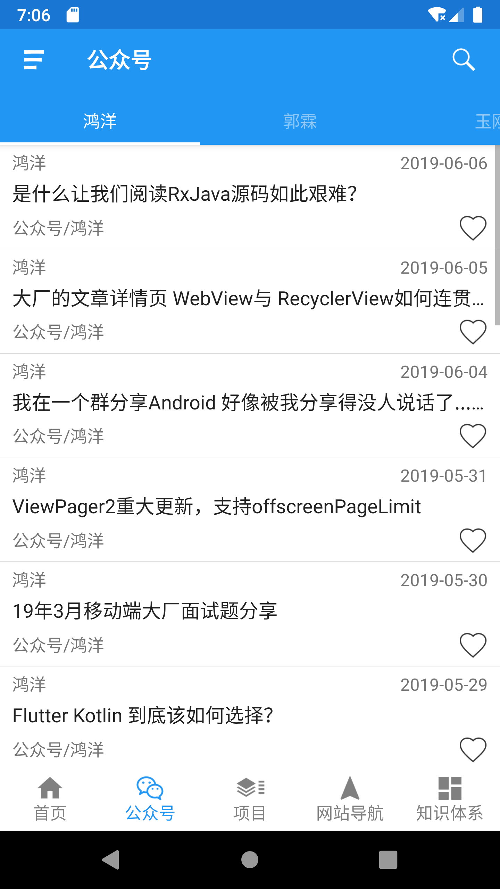 
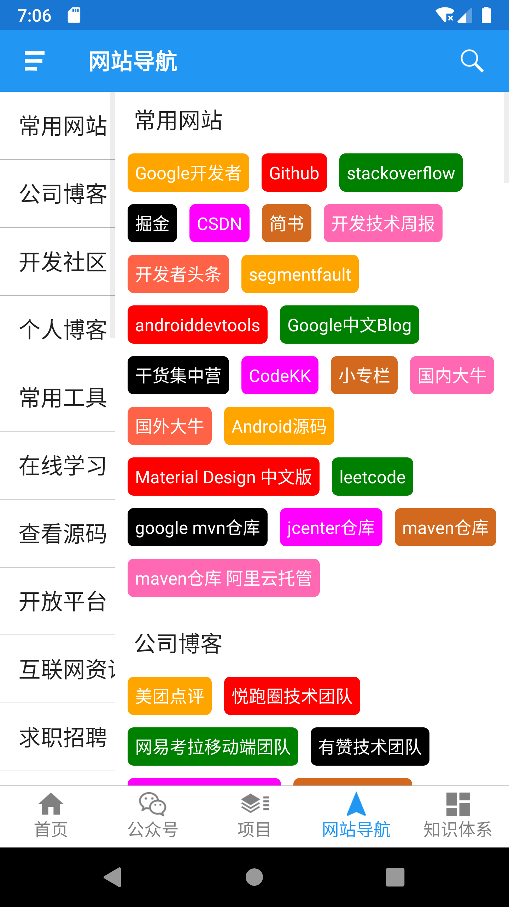 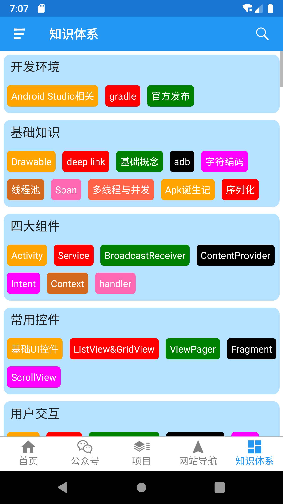 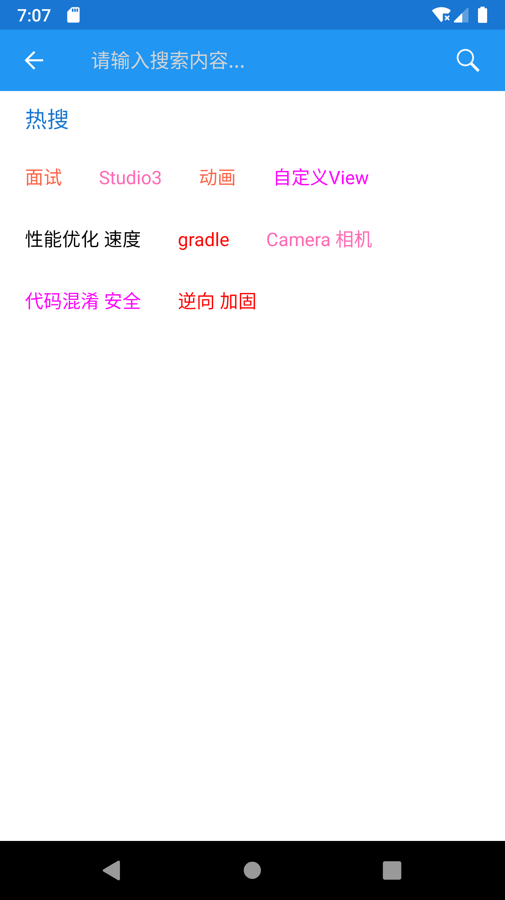
 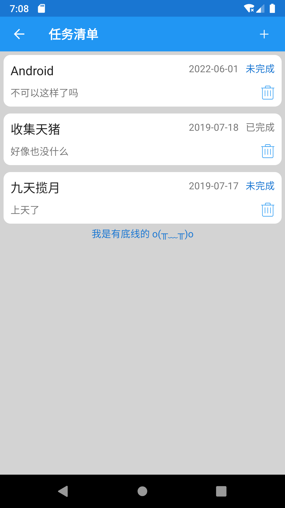 
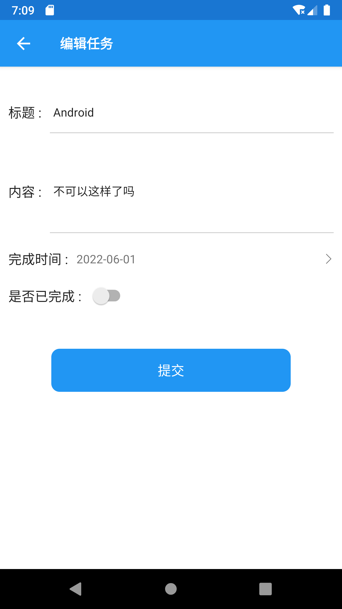 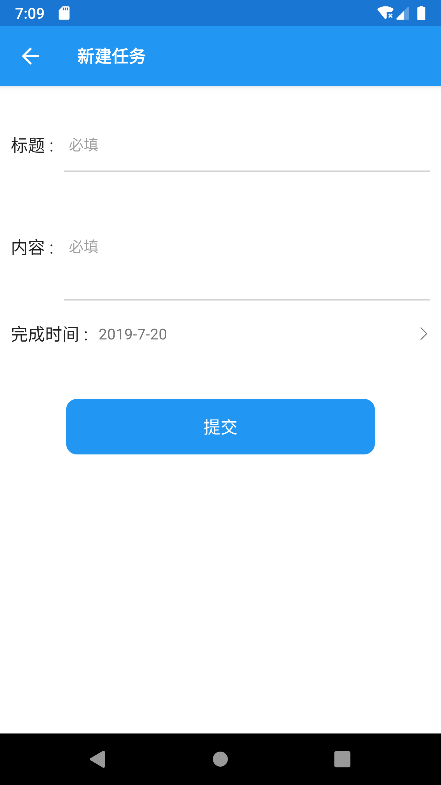 

### iOS
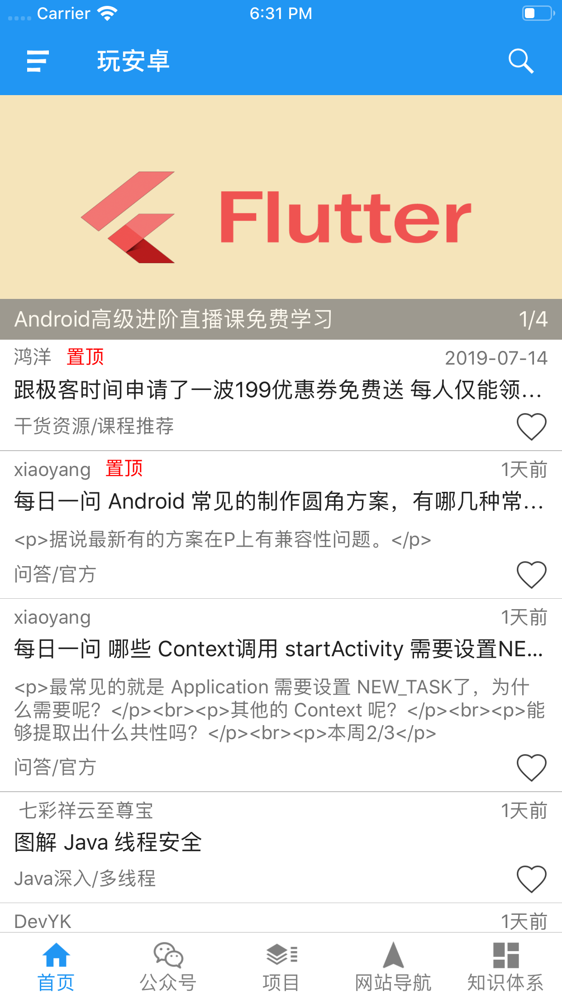 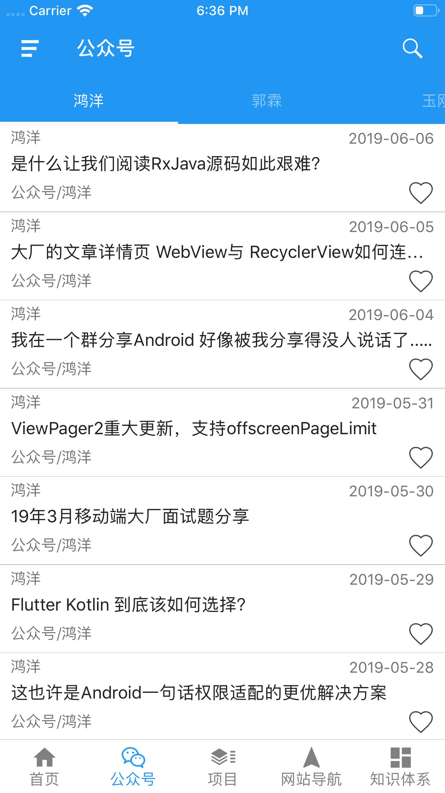 
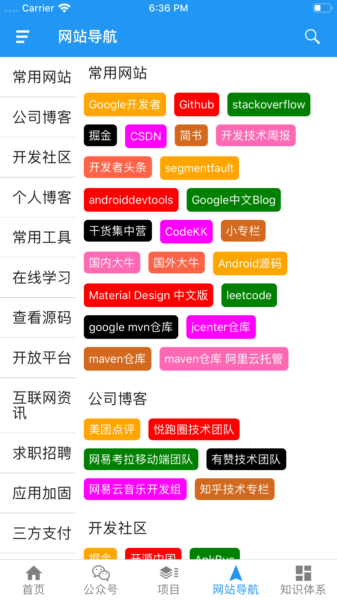 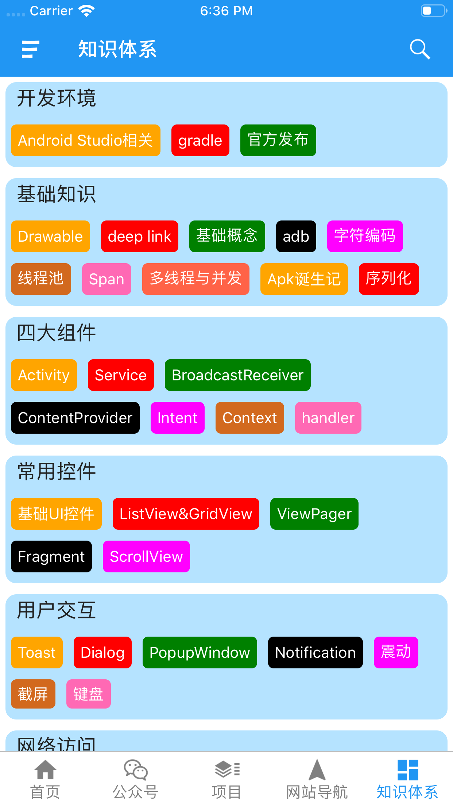 
 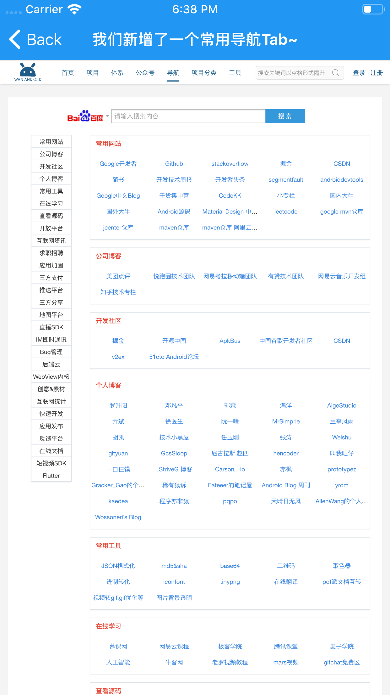 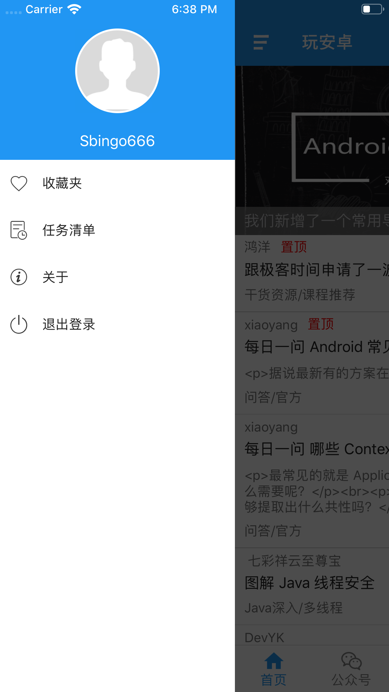
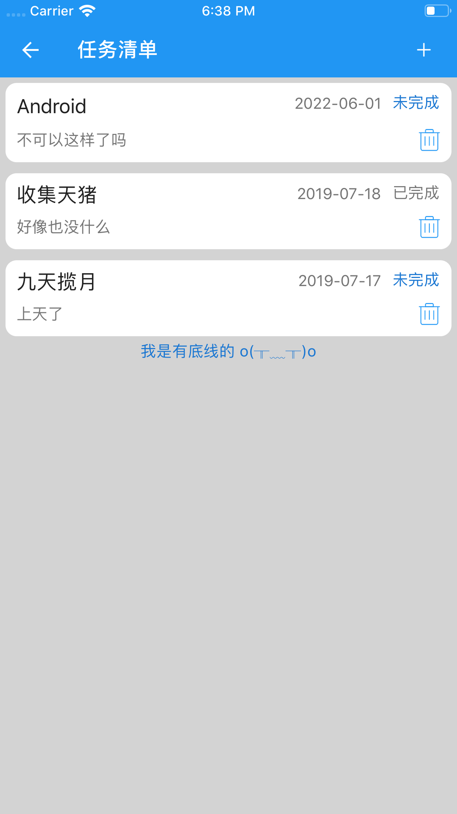 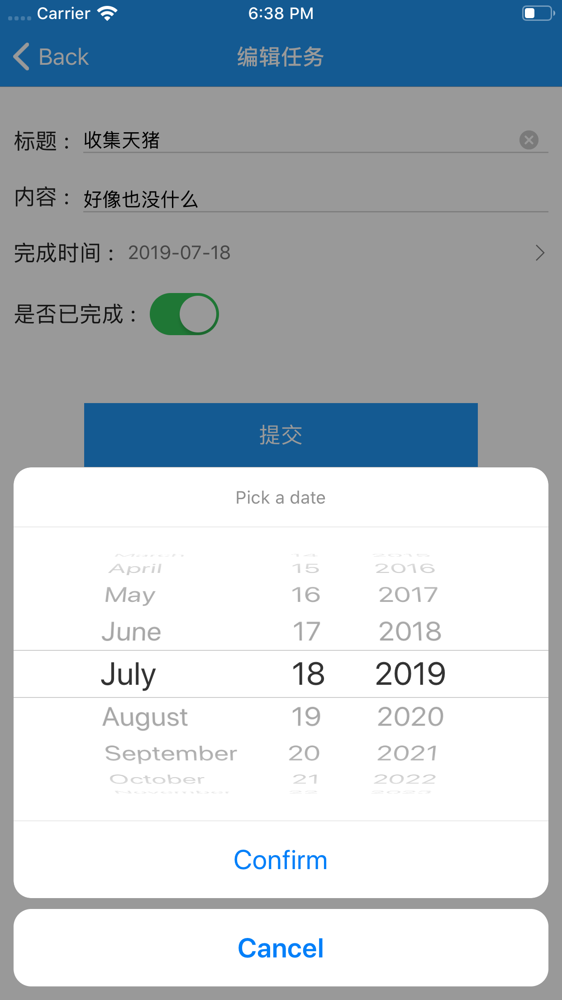 
 

### 用到的开源库
- react-navigation：界面跳转、创建抽屉布局、创建 Tab 页，创建 HeaderBar（返回按钮、标题、右侧视图）
- async-storage：持久化键值对
- react-native-modal-datetime-picker：时间选择器
- react-native-root-toast：吐司
- react-native-swiper：banner
- react-native-ultimate-listview：列表，从某些角度来看并不好用

### 感谢
[鸿神提供的数据源](https://www.wanandroid.com/blog/show/2)

### 关于作者
个人网站 &nbsp;: [Sbingo666](http://sbingo666.com/)

Github &nbsp;&nbsp;&nbsp;&nbsp;&nbsp;: [Sbingo](https://github.com/Sbingo)

CSDN &nbsp;&nbsp;&nbsp;&nbsp;&nbsp;&nbsp;: [Sbingo666](https://blog.csdn.net/recordgrowth)

Email &nbsp;&nbsp;&nbsp;&nbsp;&nbsp;&nbsp;&nbsp;: shaojianbin@sbingo666.com
